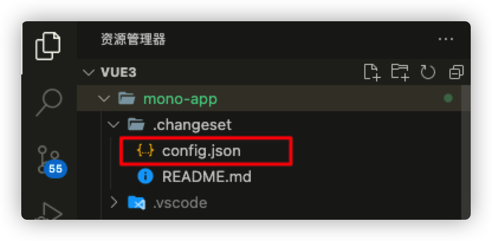
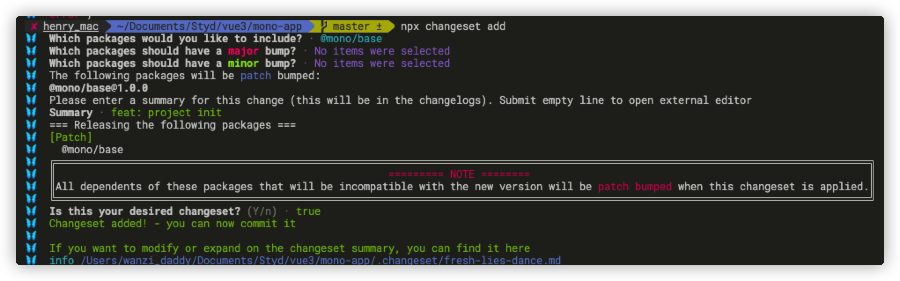
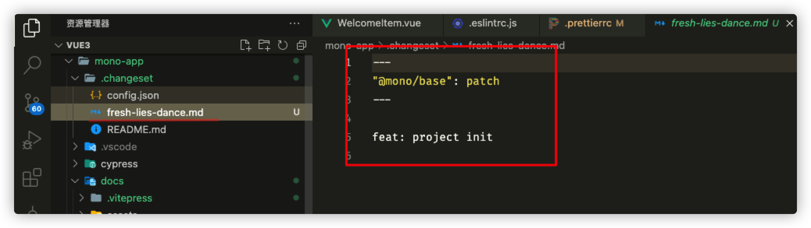
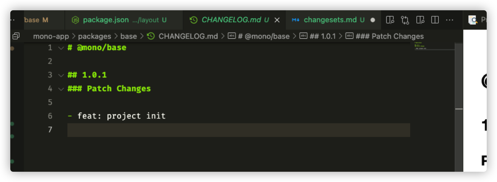

## 使用

### init 初始化

::: Tips
通过执行`changeset init`，可以在项目根目录生成一个`.changeset`目录, 并会在目录内生成一个changeset的config文件
:::

### add 添加修改记录

add在changesets中是一个非常关键的命令，它会根据mono项目生成一个changeset文件，里面包含了changeset文件信息（更新包名称，版本层级，changelog信息）

* 第一步，我们需要选择本次生成changesets所涉及的包
* 第二步，我们需要选择此次修改更新包的版本层次，版本号严格遵循`semver`的规范，分为主版本（major），次要版本（minor），补丁版本（patch）
* 第三步，填写此次更新的内容描述，如`fix: bug[xxxxx]`
* 第四步，自动生成一个文件名称随机的changeset文件，这里生成的文件名称是通过`human-id`的库随机生成的，文件名称和内容都是可以修改的。该文件的本质就是对信息做一个预存储。随着不同开发者的迭代，changeset文件可以在一个开发周期之内进行累积。

### version

`version`命令，用于消耗掉changeset文件并修改对应的包版本以及依赖该包的包版本，同事会根据之前changeset文件里面的信息来生成对应的CHANGELOG信息。

具体流程如下：

对应的changeset文件被消耗后，对应子项目的CHANGELOG以及版本发生变更，改完后，如果对变更信息不满意，还可以手动进行修改。自动修改的`CHANGELOG.md`文件内容如下:

### publish

对`npm publish`做了一次封装，同时会检查对应的`registry`上有没有对应包的版本，如果已经存在了，就不会再发包，否则会对对应的包版本执行一次`npm publish`

