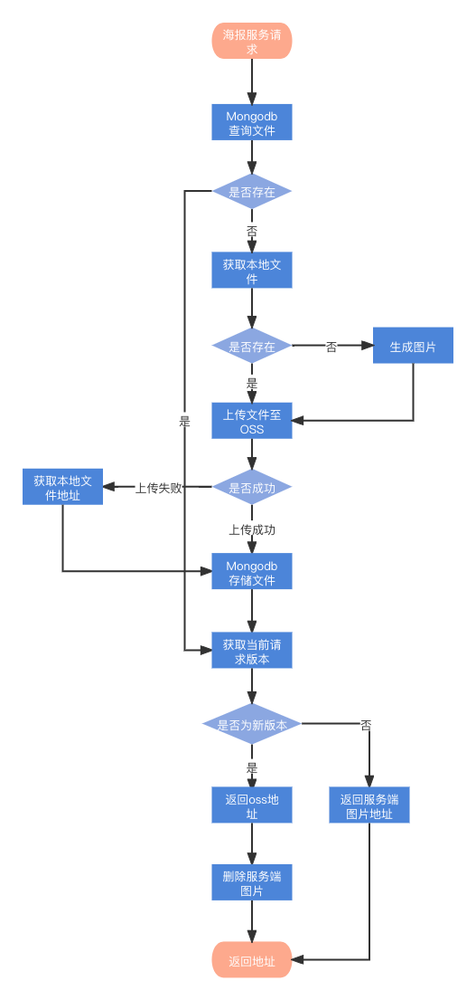

## 前言

因为这次的开发任务，需要将海报服务做一次功能升级，将服务器端生成的图片上传至ali-oss，且需要在服务器端做数据存储，以便后续的数据分析，所以本次使用到了以下的功能。

* docker 容器工具
* docker-compose 多容器管理工具

## 基础知识

**Docker，一个开源的容器工具，让开发者可以轻松的进行开发，因为它的沙箱机制，不会影响到宿主环境，且可以将使用的应用打包到一个可移植的镜像中。**

在 Docker 体系里，有四个对象 ( Object ) 是我们不得不进行介绍的，因为几乎所有 Docker 以及周边生态的功能，都是围绕着它们所展开的。它们分别是：
* **镜像 ( Image )**
* **容器 ( Container )**
* **网络 ( Network )**
* **数据卷 ( Volume )**

## 前期准备

### 上传流程图



### 业务需求

* 图片上传至ali-oss
* 服务端生成的图片需要被删除
* 生成图片的数据需要被存储在服务端数据库，以便后续数据分析

### 开发依赖

* ali-oss ali-oss对象存储上传的npm包
* mongoose 一个对象文档模型(ODM)库，封装了对mongodb的相关操作
* docker mongodb 非关系型数据库


## 着手开发

### ossService

``` js
const OSS = require('ali-oss');
const configData = require('../config/index')
class OssService {
  constructor() {
    this.client = new OSS({
      region: configData.oss_region,
      accessKeyId: configData.oss_accessKeyId,
      accessKeySecret: configData.oss_accessKeySecret,
      bucket: configData.oss_bucket,
      secure: true
    });
  }
  async putFile(fileName, filePath) {
    try {
      let result = await this.client.put(fileName, filePath)
      return result
    } catch (error) {
      throw new Error(error);
    }
  }
  async getFile(fileName) {
    try {
      // 1）判断本地文件是否存在
      // 2）不存在，获取OSS图片
      // 3）存在，返回本地图片地址，上传本地图片至OSS
      let result = await this.client.get(fileName)
      return result
    } catch (error) {
      throw new Error(error);
    }
  }
  async existFile(fileName) {
    try {
      let { res } = await this.client.head(fileName)
      let fileUrl = res.requestUrls && res.requestUrls.length && res.requestUrls[0]
      return {
        isExistInOss: true,
        fileUrl
      }
    } catch (error) {
      if (error.code === 'NoSuchKey') {
        return {
          isExistInOss: false,
          fileUrl: ''
        }
      } else {
        throw new Error(error)
      }
    }
  }
}
```


### dbService

``` js
# 创建数据库连接 screenshotImgs.js
const mongoose = require('mongoose');
const configData = require('../config/index')
const connectUrl = process.env.NODE_ENV === 'development' ? '101.132.138.179' : 'localhost'
// 1) 连接mongodb数据库
mongoose.connect(`mongodb://${connectUrl}:${configData.db_port}/${configData.db_name}`,
  {
    useNewUrlParser: true,
    authSource: "admin",
    auth: {
      username: configData.db_userName,
      password: configData.db_password
    }
  }, (err)=>{
    if(err) throw new Error(err)
  })

# 操作数据库

const ScreenShotImgModel = require('./model/screenshotImgs.js')

module.exports = {
  async add(imgData) {
    let key = imgData.key
    let result = await ScreenShotImgModel.findOne({key});
    console.log('add result', result, imgData);
    if (!result) {
      await ScreenShotImgModel.create(imgData);
    }
  },
  async search(key) {
    // 1）查询数据结构
    let result = await ScreenShotImgModel.findOne({key});
    console.log('search result', result);

    // 2) 存在数据
    if (result) {
      return {
        isExistInOss: true,
        fileUrl: result.url
      }
    }
    // 3) 不存在数据
    return {
      isExistInOss: false,
      fileUrl: ''
    }

  }
}

```

### 上传业务

``` js
  // 1）判断文件是否存在于OSS上
  let { isExistInOss, fileUrl } = await dbService.search(hash)
  // 2) 当文件不存在于OSS上，查询其是否在本地
  if (!isExistInOss) {
    // 3) 判断本地是否存在该文件
    const isExistLocal = await Fse.exists(screenshotPath)
    // 4) 当文件不存在于本地上，生成文件
    if (!isExistLocal) {
      // 5) 当文件不存在于本地上，生成文件
      const page = await browser.newPage()
      await page.setViewport({
        width: vw,
        height: vh
      })

      await page.goto(url)
      await page.waitFor(waitFor)
      // await page.waitForSelector('img')
      if (selector) {
        const rect = await page.evaluate(selector => {
          const element = document.querySelector(selector)
          if (!element) return null
          const { x, y, width, height } = element.getBoundingClientRect()
          return { left: x, top: y, width, height, id: element.id }
        }, selector)
        if (!rect) {
          throw Error(`Could not find element that matches selector: ${selector}.`)
        }
        await page.screenshot({
          path: screenshotPath,
          quality,
          clip: {
            x: rect.left,
            y: rect.top,
            width: rect.width,
            height: rect.height
          }
        })
      } else {
        await page.screenshot({
          path: screenshotPath,
          quality,
          fullPage: true
        })
      }
      await page.close()
    }
    // 6) 上传文件至Oss
    let file = await oss.putFile(screenshotFileName, screenshotPath)
    await dbService.add({
      key: hash,
      date: moment().format('YYYY-MM-DD'),
      url: file.url,
      platform: req.baseUrl,
      queryString: reqQueryString
    })
    // 7) 删除本地文件
    Fse.removeSync(screenshotPath)
    fileUrl = file.url
  }
```

## 总结

本地开发使用了docker的简单知识，涉及到了jenkins构建，mongodb数据库的相关操作，oss上传，开发难度较低，但是需要考虑的点还是比较多的。


