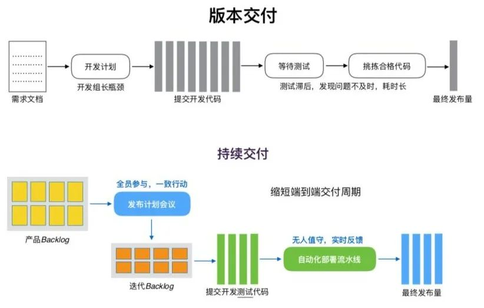

一种用于管理代码提交以及项目版本的工作流程

## 介绍

在日常开发中，遵循Git-flow工作流，我们会创建以下几类分支，现在来简单的介绍一下它们的作用

###  Master分支
主干分支，其不可修改，代码由其他分支合并。

###  Develop分支
主开发分支,包含所有要发布到下一个release的代码，主要用于合并其他分支，如feature，hotfix

###  Release分支
当我们希望发布一个版本时，我们基于develop分支创建一个新的release分支,当这个release分支上线回归完成后，我们就将其合并至master和develop分支

###  Hotfix分支
当我们在生产环境发现一个bug时，我们需要建一个Hotfix分支，完成Bug修复后，将其合并回master与develop分支（由于develop分支的改动会合并至release分支，release分支永远会包含最新的线上代码）

## 使用

接下来会简单的介绍一下git-flow工作流在各类分支上的使用流程。

### 从Master分支创建Develop分支

所有的Master分支上的提交都需要打tag,且Master分支上不存在commit。（Develop分支基于Master分支）

### 开发新的功能
Develop分支用于开发功能，联调接口，并自测功能

1. 从develop分支，check out 一个新的feature分支
2. 合并至develop分支
3. 删除feature分支

### 线上发版

release分支基于develop分支创建，在创建了一个指定版本号的release分支后，我们可以在release分支上进行测试与bug的修改。
需要注意的是一旦release分支被创建，就不可以将develop分支的代码再次合并至release分支

1. 从develop分支拉出release分支
2. 测试完毕后，将release分支合并至master并打上tag
3. 将release分支合并至develop分支
4. 删除release分支

### 线上bug修复

日常开发中，难免遇到线上Bug，遵循以下步骤，解决分支管控问题。

1. 从master分支拉出hotfix分支
2. bug修复，测试后合并回master分支与develop分支
3. 给master分支打上tag
4. 删除hotfix分支

## 优缺点

git-flow是典型的版本交付，交付周期较长，适用于软件开发，因用户在生产环境有多个可选版本

### 缺点
* 交付时间取决于测试的资源是否充裕
* 交付大量的代码合并，在多人开发时，存在的代码冲突会导致合并的人耗费大量的精力

