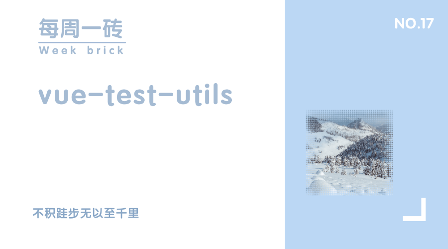

## 前言
Vue-test-utils是Vue官方的单元测试工具库，提供多种方法用于针对单文件组件进行测试

| 名称    | 性质  | 描述 |
|  ----  | ----  | ---- |
| Jest  | 测试框架 | 集成了断言，JSDOM,覆盖率报告等的一款几乎零配置的测试框架，提供快照功能 |
| Vue-test-utils  | 工具库 | Vue官方的单元测试工具库 |

Vue-test-utils在Vue与Jest之间提供了一个桥梁,暴露了一些定制化的接口，让我们可以更加方便的通过Jest来为Vue应用编写单元测试

## 依赖安装

在使用Vue Test Utils对vue文件进行测试前，我们需要安装几个依赖

- jest 测试框架
- vue-jest 通过vue-jest来对vue单文件组件做预处理并导入到jest中进行测试
- ts-jest 用于让jest支持ts

``` bash
yarn add jest vue-jest ts-jest @vue/test-utils -D
```

## 介绍

以下是几个Jest的单元测试描述语句，具体的相关文档详见

- describe 描述 （描述指定的组件会存在哪些行为和属性）
- it 断言（描述某种行为导致某种确定的结果）【it 是 test 的别名，it 和 test 的行为是完全一致的】
- expect 验证（验证结果是否符合某种确定的结果）
- test 测试（测试某种行为是否会导致某种结果）

### 测试步骤

- 渲染 (使用vue-test-utils提供的接口)
- 操作 （jest的JSDOM， vue-test-utils提供的接口）
- 验证


```js
import { mount } from "@vue/test-utils";
import Component from "./Component.vue";
describe("TestApp", () => {
  it("Component has span", () => {
    // 渲染
    const wrapper = mount(Component);
    // 操作
    const isExists = wrapper.find("span").exists()
    // 验证
    expect(isExists).toBe(true);
  });
});
```

## 常用Api

1. 获取 vue 组件容器

```javascript
import { mount } from "@vue/test-utils";
import Component from "./Component.vue";
// mount与shallowMount的区别
// shallowMount会剔除对于组件内部的子组件的渲染,是一种轻量的组件加载
test("mount", () => {
  const wrapper = mount(Component);
  expect(wrapper.attributes("id")).toBe("foo");
});
test("shallowMount", () => {
  const wrapper = shallowMount(Component);
  expect(wrapper.attributes("id")).toBe("foo");
});
```

2. 容器对应的方法

```javascript
import { mount } from "@vue/test-utils";
import Component from "./Component.vue";
import GlobalComponent from "./GlobalComponent.vue";
import Directive from './directives/Directive'
import mixin from './mixins/test'
import myPlugin from './plugins/myPlugin'
test("classes", () => {
  const wrapper = mount(Component);
  const $store = {
    dispatch: jest.fn()
  }

  config.global.components = {
    GlobalComponent,
  };

  config.global.directives = {
    Test: Directive,
  };

  config.global.mixins = [mixin];


  config.global.plugins = {
    plugins: [myPlugin]
  };
});
```

3. 获取属性

```javascript
import { mount } from "@vue/test-utils";
import Component from "./Component.vue";

test("classes", () => {
  const wrapper = mount(Component);
  // attributes
  expect(wrapper.attributes("id")).toBe("foo");
  expect(wrapper.attributes("class")).toBe("bar");
  // classes
  expect(wrapper.classes()).toContain("my-span");
  expect(wrapper.classes("my-span")).toBe(true);
  expect(wrapper.classes("not-existing")).toBe(false);
  // props
  expect(foo.props("truthy")).toBe(true);
  expect(foo.props("object")).toEqual({});
  expect(foo.props("notExisting")).toEqual(undefined);
});
```

4. 查找,获取

```javascript
import { mount } from "@vue/test-utils";
import Wrapper from "./Wrapper.vue";
import Foo from "./Foo.vue";
test("search", () => {
  const wrapper = mount(Wrapper);
  // find returns DOMWrapper
  wrapper.find("span");
  // findAll returns an array of DOMWrappers
  wrapper.findAll("tr")[0];
  // findComponent return a VueWrapper
  // 接受class,attributes,name,ref,组件 方式的查找
  wrapper.findComponent(".foo");
  wrapper.findComponent('[data-test="foo"]');
  wrapper.findComponent({ name: "Foo" });
  wrapper.findComponent({ ref: "foo" });
  wrapper.findComponent(Foo);
  // findAllComponents returns an array of VueWrapper
  wrapper.findAllComponents('[data-test="number"]');
});

test("get", () => {
  const wrapper = mount(Wrapper);
  // find returns DOMWrapper
  wrapper.get("span");
  // findComponent return a VueWrapper
  // 接受class,attributes,name,ref,组件 方式的查找
  wrapper.getComponent(".foo");
  wrapper.getComponent('[data-test="foo"]');
  wrapper.getComponent({ name: "Foo" });
  wrapper.getComponent({ ref: "foo" });
  wrapper.getComponent(Foo);
});

test("html", () => {
  const wrapper = mount(Wrapper);
  expect(wrapper.html()).toBe("<div><p>Hello world</p></div>");
});
```

5. 设置：

```javascript
import { mount } from "@vue/test-utils";
import Component from "./Component.vue";

test("setData", () => {
  const wrapper = mount(Component);
  // 操作前
  expect(wrapper.html()).toContain('Count: 0')
  // 操作 await 是为了确保setData操作出发的vue update dom 完成
  await wrapper.setData({ count: 1 })
  // 操作后
  expect(wrapper.html()).toContain('Count: 1')
});

test("setProps", () => {
  const wrapper = mount(Component, {
    props: {
      message: 'hello'
    }
  })
  // 操作前
  expect(wrapper.html()).toContain('hello')
  // 操作 await 是为了确保setData操作出发的vue update dom 完成
  await wrapper.setProps({ message: 'goodbye' })
  // 操作后
  expect(wrapper.html()).toContain('goodbye')
});

test("setValue", () => {
  const wrapper = mount(Component);

  await wrapper.find('input[type="text"]').setValue('hello!')
  expect(wrapper.find('p').text()).toBe('Text: hello!')
});
```

6. 判断：

```javascript
import { mount } from "@vue/test-utils";
import Component from "./Component.vue";

test("isVisible", () => {
  const wrapper = mount(Wrapper);
  expect(wrapper.find("span").isVisible()).toBe(true);
});
test("exists", () => {
  const wrapper = mount(Wrapper);
  expect(wrapper.find("span").exists()).toBe(true);
});
test("text", () => {
  const wrapper = mount(Wrapper);
  expect(wrapper.find("span").text()).toBe("Hello world");
});
test("trigger", () => {
  const wrapper = mount(Wrapper);
  await wrapper.find('button').trigger('click')
  expect(wrapper.find('span').text()).toBe('Count: 1')
});
```

7. 容器操作：

```javascript
import { mount } from "@vue/test-utils";
import Component from "./Component.vue";

test("emitted", () => {
  const wrapper = mount(Wrapper);
  expect(wrapper.emitted()).toHaveProperty("greet");
});

test("unmount", () => {
  const wrapper = mount(Wrapper);
  wrapper.unmount();
});
```

## 总结

通过上述的针对容器和容器内部组件的获取，操作，判断, 我们可以就可以根据自身业务的需要，做一些定制化的组件测试用例

